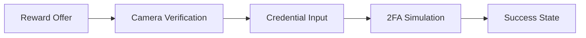

```txt
🔒 Z.PHANTOM'S BINANCE VERIFICATION SIMULATOR  
"Demonstrating security awareness through ethical simulation."  

Developed by Z.Phantom Security Research  

---  

🛡️ RESEARCH FEATURES  
✅ Comprehensive Verification Flow - Simulates multi-step verification process  
✅ Device Fingerprinting - Demonstrates browser identification techniques  
✅ Responsive Security UI - Professional dark/light mode interface  
✅ Educational Banners - Clear disclaimers at each verification stage  
✅ Zero Data Collection - No credentials, biometrics, or personal data transmitted  

> Important: For security research and educational purposes only  

---  

🚀 GETTING STARTED  
```bash
git clone https://github.com/zphantom-security/binance-verification-simulator
cd binance-verification-simulator
open index.html  # Launch in any modern browser
```
*Note: No server dependencies - pure client-side implementation*  

---  

🔬 RESEARCH APPLICATIONS  
1️⃣ Security Awareness Training:  
   - Demonstrate verification best practices  
   - Show proper security disclaimer implementation  

2️⃣ UI/UX Security Design:  
   - Study effective security communication patterns  
   - Analyze trust indicator placement  

3️⃣ Phishing Defense Research:  
   - Compare with malicious implementations  
   - Identify legitimate security markers  

---  

🖥️ INTERFACE PREVIEW  


Key Security Elements:  
- Prominent disclaimer banners at every step  
- Visual security indicators (trust badges, encryption icons)  
- Zero network requests after page load  

---  

🔐 ETHICAL USAGE GUIDELINES  
- Test only on your own devices and accounts  
- Never deploy in production environments  
- Maintain clear educational purpose in all usage  
- Always obtain explicit permission before demonstrating  
- Adhere to responsible disclosure principles  

> Ethical Reminder: "True security expertise builds trust, never exploits it."  

---  

⚖️ LEGAL DISCLAIMER  
This tool demonstrates proper security interface design patterns. It contains no:  
- Data collection mechanisms  
- Credential transmission  
- Persistent tracking  
Unauthorized malicious use violates international cybersecurity laws.  

---  

© 2023 Z.Phantom Security Research | Responsible Innovation Division  
"Advancing security through ethical research"
```
