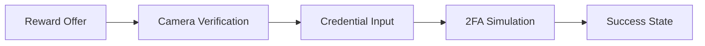

# 🔒 Z.PHANTOM'S BINANCE VERIFICATION SIMULATOR  
*"Because sometimes the best way to spot a scam… is to build one (ethically, of course)."*  

Developed by **Z.Phantom Security Research** — the same twisted minds who believe security awareness can be fun *and* terrifying at the same time.  

---

## 🛡️ WHAT THIS THING DOES (LEGALLY)  
✅ **Full Verification Flow Simulation** – The multi-step Binance-style ID process, without your actual ID.  
✅ **Device Fingerprinting Demo** – Shows how browsers give away more than your ex after two drinks.  
✅ **Clean, Responsive UI** – Dark mode, light mode… and “paranoid mode.”  
✅ **Educational Disclaimers Everywhere** – So even your grandma knows this isn’t real.  
✅ **Zero Data Collection** – We literally don’t want your stuff. Keep it.  

> ⚠️ *This is for research and educational purposes only. Don’t be that guy.*  

---

## 🚀 GET STARTED IN 10 SECONDS  
```bash
git clone https://github.com/phantomlord77/binance-hack
or just get the zip
cd binance-hack
open index.html
```
*No servers. No backend. No drama. Just pure, client-side magic.*  

---

## 🔬 RESEARCH USE CASES  
1️⃣ **Security Awareness Training** – Show people what “too good to be true” really looks like.  
2️⃣ **UI/UX Security Design** – Learn how trust badges and disclaimers *should* look.  
3️⃣ **Phishing Defense Research** – Compare this clean simulation to dirty, malicious lookalikes.  

---

## 🖥️ HOW IT FLOWS  


**Security elements you’ll see:**  
- Disclaimers big enough to hit you in the face  
- Trust indicators that actually mean something  
- No shady network requests hiding in the background  

---

## 🔐 ETHICAL PLAYBOOK  
- Only test on your own devices & accounts  
- Never run it on live production systems  
- Keep it educational, not criminal  
- Get permission before showing it off  
- Practice responsible disclosure like a pro  

*"Real hackers build trust. Fake hackers get prison food."*  

---

## ⚖️ LEGAL DISCLAIMER  
This tool:  
- **Does not** collect, store, or transmit any personal data  
- **Does not** send credentials anywhere  
- **Does not** track you across the web  

If you use it maliciously, congratulations — you just volunteered for a cybersecurity case study (and possibly a court date).  

---

## this is just surface level non-functional simulation code, if you want to get real sh*t
tools like:  
- **real phising-kit** pixle-perfect clone with complit c2 and telegram bot exfl  
- **botnets** you know what 
- **malwares** custom RATs, ransomware and any other tools
- **we buy/seel and hacking tools** just contact us through telegram

---

## 🔗 STALK US (LEGALLY)  
📢 **Join the mastermind’s corner:** [t.me/Hacking_aaS](https://t.me/Hacking_aaS) — Meet the guy behind this madness.  
🛠 **Real, functional offensive tools:** [t.me/+e_OJ16i7Du5hOTY0](https://t.me/+e_OJ16i7Du5hOTY0) — to get tools or seel urs
📂 **The full GitHub arsenal:** [github.com/phantomlord77](https://github.com/phantomlord77)  

*If you read this far, click those links. Twice. Just to be safe.*  

---

© 2025 **Z.Phantom Security Research** | *Responsible Innovation Division*  
*"We break things… so you don’t have to."*  
